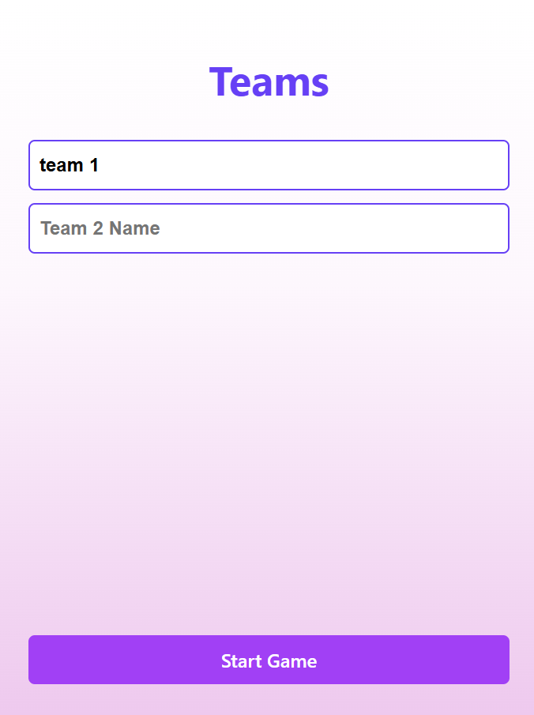
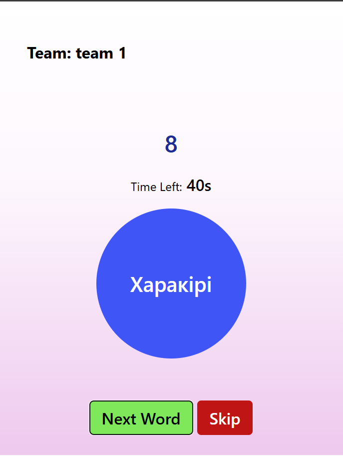
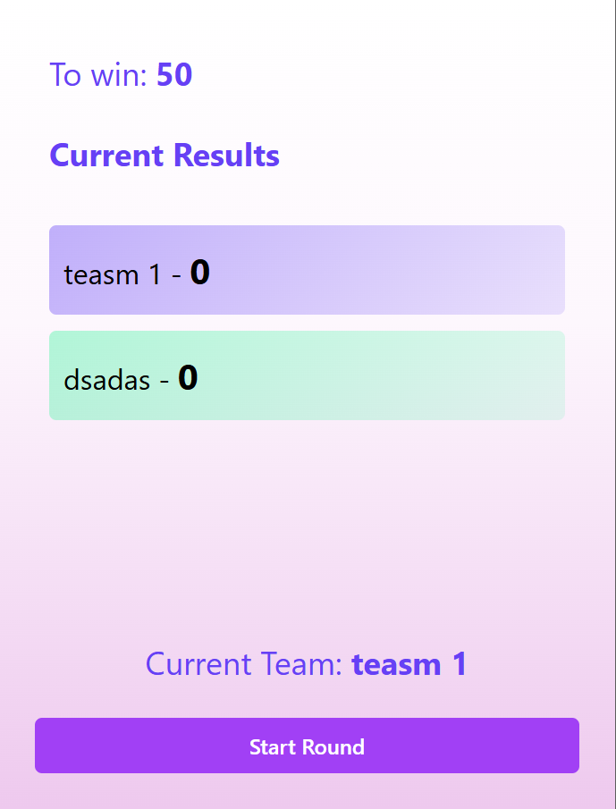

# React + Vite

This template provides a minimal setup to get React working in Vite with HMR and some ESLint rules.

Currently, two official plugins are available:

# Alias Game

Alias Game is a browser-based team word-guessing game: describe the displayed word without saying it, earn points for correct answers, and see which team wins the round.

## Screenshots

### Team setup



### Gameplay



### Results



## Run locally

```bash
npm install
npm run dev
```

## Scripts

| Command         | Description                         |
| --------------- | ----------------------------------- |
| `npm run dev`   | Starts the Vite development server. |
| `npm run build` | Creates a production build.         |
| `npm run lint`  | Runs ESLint.                        |
